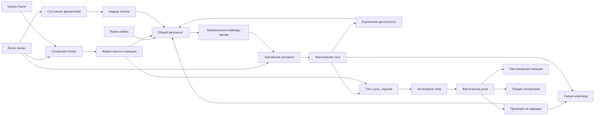

# Динамика подвижных летающих объектов

Статус: **нормативный контракт реализованной системы**.

Этот документ фиксирует общую механику подвижных летающих объектов в Make a
Mess. Эталонные реализации — состав-дирижабль в Grand Terminal, небесный
драккар в Viking Village, дирижабль № 07 у высокой мачты Town и гексакоптер
HX-6 на дворовой площадке Town. Последний показывает, что контракт не привязан
к плавучести: у него подъём делают ЛОПАСТИ, `envelopeMatch` указывает на них,
и `liftReserve` читается как тяговооружённость — ни строчки общего контроллера
для этого менять не пришлось. Следующий
корабль должен подключаться к этому контракту как новая физическая машина, а
не получать собственную параллельную систему движения.

Документ отвечает на вопрос **как объект честно летает, повреждается, перевозит
человека и швартуется**. Он не описывает:

- визуальное строительство формы — см.
  [`transport-lessons.md`](./transport-lessons.md);
- продуктовую топологию островов, Астану и смену формы — см.
  [`inter-island-travel.md`](./inter-island-travel.md);
- общие правила строительства мира — см.
  [`.claude/skills/world-building/SKILL.md`](../../../.claude/skills/world-building/SKILL.md).

Численные допуски принадлежат определениям машин и исполняемым тестам. Этот
документ задаёт смысл параметров, границы ответственности и инварианты, которые
нельзя менять неявно.

---

## 1. Главный принцип

Летающий объект — разрушаемое физическое тело. Маршрут не перемещает его и
автопилот не исправляет позу напрямую.

```text
маршрут задаёт требования
        ↓
автопилот распределяет желаемое управление по валам
        ↓
уцелевшие actuators исполняют команды настолько, насколько физически могут
        ↓
автопилот получает пару «запрошено → доставлено» и уточняет доступность
        ↓
фактические силы, масса, инерция, сопротивление и контакты определяют движение
        ↓
фактическое движение продвигает прогресс маршрута
```

Из этого следуют три обязательных свойства:

1. Один маршрут могут проходить разные машины, если хватает их возможностей.
2. Повреждение машины меняет доставленное управление и результат рейса.
3. Рейс завершается по физически устойчивой позе у причала, а не по времени или
   достижению последней точки кривой.

Любая реализация, которая ставит `position`, `rotation`, `progress` или
пассажира в заранее вычисленное состояние ради красивого полёта, обходит
систему и считается дефектом.

## 2. Словарь

| Термин | Значение |
|---|---|
| **Форма / vehicle** | Конкретная машина: состав, драккар, городской дирижабль или следующая форма. |
| **Carrier** | Подвижная система координат, которую создаёт физическая машина для деталей, света и пассажиров. |
| **Frame** | Паспорт геометрии carrier-а: кластер, начало координат, нос, подъёмный центр, опоры и контактные щупы. |
| **Compound cluster** | Одно физическое тело из всех присоединённых кусков машины. |
| **Independent member** | Деталь со своей артикуляцией, например весло, которая следует carrier frame, но не дублируется в жёстком коллайдере. |
| **Actuator** | Разрушаемый исполнитель команды: двигатель, банк вёсел, рулевое весло. |
| **Berth** | Авторская поза целой машины у причала; в ней её носовой узел совпадает с точкой захвата причала. |
| **Mooring point** | Физическая точка на носовом узле carrier-а, которую мачта, буфер или причальные снасти принимают в своей авторской точке захвата. |
| **Ground landing** | Устойчивый физический контакт машины с настоящей поверхностью. Это наземное состояние, а не швартовка. |
| **Route artifact** | Геометрия пути, именованные участки и требования к высоте и скорости. |
| **Flight kind** | Выбранный маршрутный сценарий: например, беспилотный круг или пассажирский обзорный рейс. |
| **Approach gate** | Допуски входа в посадочный створ по месту, курсу и скорости. |
| **Docked pose** | Полностью успокоенная поза, в которой mooring point физически вошёл в допуск точки захвата причала. |
| **Requested control** | Команда конкретному органу управления, которую вычислил автопилот. |
| **Drive / shaft command** | Signed requested throttle конкретного вала после feedback-based allocation автопилотом. Знак задаёт прямое вращение или реверс. |
| **Delivered control** | Часть команды, которую реально передали уцелевшие исполнители. |
| **Propulsion health** | Фактическая доступная доля каждого движителя, вычисленная по оставшимся частям. |
| **Propulsion feedback** | Оценка доступности канала, которую автопилот вывел из предыдущей пары requested/delivered. |
| **Flight clearance** | Решение надзора: разрешён ли беспилотный/пассажирский рейс и с каким ограничением скорости. |
| **Moving support** | Физическое тело под ногами человека с линейной и/или угловой скоростью. |

Слово «корабль» далее означает любую форму, включая состав-дирижабль.

## 3. Архитектурная граница



### Кто чем владеет

| Слой | Владеет | Не имеет права |
|---|---|---|
| Сцена | Кусками машины, причалом, точками взаимодействия, оболочками мира | Задавать полёт анимационной кривой |
| Frame | Локальной геометрией carrier-а и контактами корпуса | Знать конкретный маршрут |
| Vehicle definition | Возможностями машины, взаимодействиями, выбором маршрутов и допусками | Управлять состоянием тела напрямую |
| Route artifact | Линией, высотой, скоростью и маркерами фаз | Знать массу, двигатели или название машины |
| Автопилот | Запрошенными тягой, рулём и lift trim; распределением тяги по валам из оценённой доступности и реальных плеч | Знать число оставшихся лопастей или телепортировать машину |
| Конверт наведения | Требуемой точностью каждого этапа и порогом настоящего заброса | Менять пороги по факту попадания и знать, кто стрелял |
| Дифферентовка | Положением подвижных грузов по измеренным крену и тангажу | Прикладывать момент, двигать trim centre или знать маршрут |
| Исполнительный слой | Фактическим исполнением команды уцелевшими механизмами и измерением requested/delivered | Перераспределять команды, менять маршрут или решать, можно ли брать пассажира |
| Надзор полёта | Допуском рейса, ограничением скорости и capability-aware watchdog | Выдавать автопилоту готовые обороты, подменять силы или чинить повреждение |
| Автоматика безопасности | Дистанцией, относительной скоростью сближения, тормозным путём и advisory об угрозе | Самостоятельно выдавать тягу, руль, lift trim или менять pose |
| Интегратор | Позой и скоростями из суммы сил | Знать CJM или цель рейса |
| Passenger dynamics | Контактом ног, инерцией, переходом между supports | Приклеивать стоящего человека к carrier transform |
| Telemetry | Измерениями фактического движения | Управлять машиной или форматировать конкретный HUD |
| Failure/recovery | Выявлением отказа и порядком восстановления | Делать повреждённый объект исправным на глазах |

## 4. Контракт определения машины

Общий контроллер потребляет `AirVehicleDefinition`. Определение состоит из
четырёх частей.

### 4.1. Frame

`VehicleFrameDefinition` обязан задать:

- стабильный `id` машины и `clusterId` разрушаемого объекта;
- `origin` — авторскую точку вращения frame-а;
- единичное направление `nose`;
- `mooringPoint` — точку физического захвата на носу машины в авторской
  berth pose;
- `liftCentre` — авторский центр подъёмного объёма;
- `envelopeMatch` — признак частей, потеря которых уменьшает подъём;
- нижние `supports`;
- коэффициенты статического и динамического трения нижних опор;
- `hullProbes` для контакта бортом, носом, крышей или днищем;
- исключения `independentMemberMatches`, если деталь артикулируется отдельно;
- `telemetryLabel`.

Все точки frame-а авторятся в мировой позе покоя. Runtime переводит их через
один и тот же carrier transform. Не следует смешивать в одном паспорте
локальные и мировые координаты.

### 4.2. Взаимодействия

У машины могут быть два независимых запуска:

- `departure` — внешний беспилотный рейс у табло, каната, кнехта или другого
  интерфейса причала;
- `passengerFlight` — пассажирский рейс, доступный только изнутри carrier-а.

У каждого взаимодействия собственные:

- `target.id`, `kind` и presentation `cue`;
- точка и радиусы гистерезиса;
- `flightKind`;
- проверка внутреннего объёма для пассажирского запуска.

`occupancy` хранится отдельно от `flightKind`. Название маршрута не должно
служить косвенным признаком наличия человека.

Беспилотный запуск не имеет права увезти случайного пассажира. Если внешний
триггер и внутреннее пространство могут пересечься, машина обязана предоставить
безопасную `passengerDropPoint`.

### 4.3. Возможности

`flight.limits` описывает не желаемое поведение, а реальные органы машины:

- мощность одного канала тяги;
- точки приложения тяги;
- силу и опорную скорость руля;
- точку приложения рулевой силы;
- диапазон управления подъёмом;
- способность полностью снять подъём после подтверждённого аварийного
  контакта с настоящей поверхностью.

Отдельно задаются:

- линейное и угловое сопротивление;
- отношение бокового сопротивления к продольному;
- время предупреждения и начала движения;
- геометрия и допуски захода;
- допуски полной швартовки;
- визуальный тип движителя.

### 4.4. Маршрутные функции

Определение связывает машину с:

- обычными маршрутами по `flightKind`;
- внешним маршрутом возвращения;
- аварийным маршрутом ухода;
- отображением маршрутного прогресса в общую фазу рейса.

Это допустимая адаптация формы: например, поворот berth-local маршрута на курс
драккара. Внутри общего автопилота ветвлений по имени машины быть не должно.

## 5. Физическая сборка carrier-а

### 5.1. Одно тело

Все присоединённые несущие и контактные части машины образуют один compound
body. Оно одно:

- получает импульсы;
- хранит линейную и угловую скорость;
- участвует в столкновениях;
- задаёт carrier pose;
- передаёт движение свету, приборам и пассажирам.

Куски не должны одновременно существовать как часть compound collider-а и как
независимое физическое тело. Для артикулируемых вёсел и подобных деталей
должен быть ровно один владелец позы.

### 5.2. Повреждение

После разрушения детали:

1. она исключается из живых членов carrier-а;
2. её масса и инерция исчезают из расчёта машины;
3. её collider исчезает из compound body;
4. actuator contribution, если он был, исчезает;
5. отделившийся кусок получает собственное физическое тело и наследует
   движение точки отделения.

Нельзя сохранять «невидимый мотор», «призрачную массу» или коллайдер
отвалившегося весла.

### 5.3. Контакт с миром

Корпус чувствует мир через authored probes:

- нижние probes принимают вес при посадке;
- боковые и торцевые probes дают момент при ударе;
- собственные коллайдеры carrier-а исключаются из запросов;
- запрос видит как целые статические конструкции, так и уже отделившиеся
  динамические обломки;
- длина щупа включает путь точки корпуса за текущий физический шаг, поэтому
  быстрый объект не может перескочить тонкую крышу или землю между тиками;
- луч начинается внутри корпуса на величину хода опоры, а найденная дистанция
  переводится в знаковый зазор поверхности; проникшая в землю точка поэтому
  получает возрастающую реакцию и не теряет контакт из-за старта луча внутри
  геометрии;
- демпфирование сжатия и отбоя считается по относительной скорости с
  поверхностью, включая скорость самого динамического препятствия; реакция
  остаётся односторонней и никогда не притягивает корпус к земле;
- сила прикладывается в точке щупа, а не в центре тела.
- нагруженные щупы, чья мировая нормаль смотрит в поверхность под корпусом,
  образуют единый контактный патч; поэтому после крена или опрокидывания вес
  и трение может принять не только штатная опора, но и настоящая обшивка;
  результирующая кулоновская сила приложена в центре давления против
  относительной касательной скорости;
- предел трения пропорционален фактической нормальной реакции, поэтому без
  поверхности или без нагрузки «трения о воздух» не возникает;
- статический предел удерживает уже остановившуюся опору, динамический гасит
  скольжение, а дискретный импульс считается по эффективной массе патча с
  учётом инерции и ограничивается ровно остановкой за шаг — несколько опор не
  имеют права спорить друг с другом и разгонять корабль численной ошибкой.

Поэтому упёршийся нос разворачивает корабль, а разнесённые опоры сами
выравнивают севший корпус.

### 5.4. Удар — это НЕ контакт

Контакт и удар различаются по РОДУ, а не по силе, и путать их нельзя.

| | контакт | удар |
|---|---|---|
| что это | ограничение «не проникай» | событие «встретились» |
| длительность | непрерывный, пока лежим или трёмся | одномоментный |
| чем измеряется | штрафная реакция и трение щупов | изменение скорости в точке |
| кто участник | корпус и поверхность | ДВА объекта, каждый со своим материалом |
| последствие | реакция и трение | импульс обеим сторонам и, возможно, разрушение |

Вывести удар из контакта НЕЛЬЗЯ. Величина силы штрафной пружины зависит от её
жёсткости и размера шага, поэтому ею нельзя измерить удар: получится число,
которое меняется от настройки интегратора, а не от физики. Щуп остаётся
органом контакта и урона не производит никогда.

С точки зрения мира машина — обычный физический объект. У летящей в дом ракеты
нет щупов: она долетела, попала и нанесла ущерб. Разница лишь в том, что
ракета после этого исчезает, а машина остаётся и обязана получить своё.

**Обязательное и условное.** Из одного удара следуют две вещи, и у них разный
статус:

- **импульс обязателен ВСЕГДА.** Даже если ничего не сломалось, момент передан
  и поза изменилась. Он идёт в тело тем же путём, что импульс от ракеты;
- **разрушение условно.** Оно спрашивается ОТДЕЛЬНО у каждой стороны, каждая
  со своим материалом. Сторона может конструкционно пережить удар и всё равно
  получить своё из физики.

**Одно измерение — два вердикта.** Удар порождает ровно один замер, и он
спрашивается дважды — по разу на сторону:

```text
v_n     — нормальная скорость сближения в точке контакта
m_эфф   — эффективная масса машины в этой точке вдоль нормали
e       — восстановление пары материалов
доля    — вклад этой пары в общее сближение шага, Σ долей = 1
J       = m_эфф · v_n · (1 + e) · доля          импульс, обеим сторонам
I_ст    = J · f_шага / (m_куска_стороны · 320)  интенсивность стороне
```

Масштаб масс в проекте условен, а скорости настоящие, поэтому **порог
разрушения берётся по СКОРОСТИ**, а не по энергии: закон материалов уже
откалиброван в реальных м/с. Подставлять `½mv²` в шкалу урона запрещено:
масса раздута, и раздутие пройдёт насквозь. Экстенсивная сторона удара живёт
в двух местах: импульс ОДИН на весь удар и делится между одновременными
парами по вкладу в сближение (иначе корабль отскочит от собственного касания
быстрее, чем летел), а интенсивность — доставленная сила против веса куска
самой стороны, в той же калибровке, в которой закон получает её от падающего
обломка. Скорость долей не делится: она интенсивная величина.

**Кто именно получил.** Удар — это встреча двух КУСКОВ, а не двух тел. Кусок
машины называет сам коллайдер; кусок мира определяется по точке контакта.
Точка берётся из геометрических контактов манифолда (они существуют и там,
где солвер не работает), центр коллайдера — только фолбэк пустого манифолда.
Гадать «ближайший к центру» нельзя: у широкой машины первым встречает вынос,
а не центр.

**ЗАКОН ОДИН НА ОБЕ СТОРОНЫ.** Вердикт каждой стороне выносит
`classifyLandingDamage` — тот же закон, которым судится падающий обломок,
материалом и интенсивностью самой стороны. Собственной шкалы прочности нет ни
у машины, ни у мира: вторая шкала неизбежно оказывается кривой, подогнанной
под желаемый исход, и однажды уже оказалась.

**Что происходит с куском машины.** Стали и пластика в таблице обломков нет —
конструкция из них переживает контактный удар на любой скорости: стальной
набор, сваренный из брусков, не крошится о кирпичную кладку. (Оружие и взрыв
живут своими авторскими энергиями и по-прежнему могут отнять стальной кусок.)
Кусок, чей материал вердикта не пережил, выходит из compound body по §5.2 со
всеми последствиями: масса, коллайдер и actuator contribution исчезают.
Стекло при этом лопается осколками в текущей позе машины, потому что оно
стекло, а не «теряет крепление» целой деталью. Отдельной «прочности корпуса»
и отдельного «порога крепления» не существует.

**Автоматике о столкновении НЕ СООБЩАЮТ.** Она узнаёт о нём тем же способом,
что и о попадании ракеты: собственное тело поехало иначе, исполнительный слой
померил недобор, надзор задал свой обычный вопрос о достижимости. Ни автопилот,
ни надзор не получают признака «был удар» и не имеют для него особого режима.

**Штатный контакт ударом не является.** Посадка на опоры, стояние на грунте и
причальный захват — это контакт; они обязаны оставаться безнаказанными на всей
эксплуатационной скорости снижения машины. Защищает их сам закон, а не
исключение: на швартовочных и посадочных скоростях он молчит для любого
материала. Участие в ударах — свойство мира, общее для всех машин; никакого
переключателя «кому можно врезаться» не существует и существовать не может:
потребность в таком переключателе — доказательство, что неверен закон.

## 6. Масса, развесовка и подъём

### 6.0. Источник подъёма — свойство ВИДА судна

`flight.liftSource` объявляет, чем машина держится, и от этого зависит смысл
половины остальных правил:

| источник | чем держится | что значит отказ | как выглядит аварийное снижение |
|---|---|---|---|
| `buoyant` | объём газа | потеря доли каналов | плавное, всегда доступно: газ держит без управления |
| `rotor` | сами движители | геометрия удержания, см. ниже | только с РАБОТАЮЩИМИ движителями; потеряв удержание, машина падает |
| `none` | опора (рельс, вода, дорога) | — | — |

Для `rotor` подъём приложен не в замороженной точке, а в центре УЦЕЛЕВШИХ
движителей: сила рождается в них, и потеря одного из шести уводит точку
приложения к оставшимся. §6.2 при этом не нарушается — точка бежит не за
центром масс, а за физическим источником силы.

Отказ у такой машины определяется не долей уцелевших каналов, а тем, может ли
уцелевший набор одновременно дать вертикальную силу ≥ веса и нулевой момент.
Винт умеет только толкать, поэтому это выполнимо тогда и только тогда, когда
центр масс лежит внутри выпуклой оболочки уцелевших точек тяги. Отсюда три
исхода вместо двух: `flying` (это не отказ), `sinking` (управляемое снижение
с работающими движителями) и `tumbling` (падение; исход `tumble`, подъём
принудительно нулевой, никакой мягкой посадки). Реализация — чистый модуль
`vehicleLiftGeometry.ts`.

#### Потолок ровного подъёма: считать долю уцелевших каналов НЕЛЬЗЯ

«Уцелело пять колец из шести, значит осталось пять шестых тяги» — неверно, и
на этой дроби гексакоптер уже один раз получил неправильный паспорт. Винт
умеет только толкать, поэтому ради нулевого момента машина обязана пригасить
и кольцо НАПРОТИВ выбитого. Настоящий потолок даёт `levelLiftCeiling`: точное
решение задачи «максимум суммарной тяги при нулевом моменте и неотрицательной
тяге каждого винта». Для гексакоптера с одним выбитым кольцом это 0.67, а не
0.83.

Отсюда правило проектирования: тяговооружённость машины выводится ИЗ
ТРЕБОВАНИЯ к отказам, а не назначается. «На трёх движителях мягко сесть, на
четырёх лететь» — это `1 / worst(levelLiftCeiling)` по рабочим раскладкам, и
для шести колец по кругу оно даёт около 3.0.

И тот же критерий отвечает, чего купить нельзя ни за какую мощность: если
центр масс вышел за выпуклую оболочку живых движителей, потолок равен нулю.
Живых каналов при этом может быть много.

### 6.1. Живая масса

`massProperties` вычисляет по уцелевшим кускам:

- массу;
- центр массы;
- тензор инерции.

Материал и реальный объём детали участвуют в результате. Декоративное изменение
габарита не должно случайно становиться многотонным балластом.

Предполётная проверка целой формы обязана доказать:

- горизонтальный центр массы близок к запроектированному подъёмному центру;
- подъёмный центр находится достаточно выше центра массы для маятниковой
  устойчивости;
- запас подъёма больше веса;
- правый и левый органы управления имеют ожидаемые плечи;
- удаление асимметричного груза сдвигает живой центр массы в правильную
  сторону.

### 6.2. Trim centre

Для целой машины runtime фиксирует подъёмную точку:

```text
trimCentre.xz = intact centre of mass.xz
trimCentre.y  = authored liftCentre.y
```

После повреждения `trimCentre` не следует за новым центром массы. Именно
расстояние между прежним подъёмным центром и живым центром массы создаёт
естественный дифферент и крен.

Подправлять `trimCentre` после каждого повреждения — значит бесплатно
перебалансировать корабль и скрыть физический результат потери деталей.

### 6.3. Ограниченный подъём

Число уцелевших частей оболочки задаёт верхнюю границу подъёма:

```text
liftCapacity =
  intactMass × g × (liveEnvelope / intactEnvelope) × reserve
```

Текущая цель:

```text
neutralWeight = liveMass × g
liftTarget = min(
  liftCapacity,
  neutralWeight × (1 + liftCommand × liftTrimRange)
)
```

Подъём приходит к цели с ограниченной скоростью. Текущая реализация разрешает
изменить его не более чем на четверть живого веса в секунду. Газ нельзя
мгновенно создать или стравить.

Следствия:

- потеря груза сначала заставляет корабль всплыть;
- потеря оболочки снижает потолок подъёма;
- автоматика постепенно возвращает уцелевшую машину к новому нейтральному
  состоянию;
- разрушенный корабль не получает скрытого «режима удержания высоты».

## 6.4. Дифферентовка подвижным грузом — орган ГАЗОВОЙ машины

Всё, что написано ниже, относится к машине, у которой подъём приложен в одной
точке, а тяга идёт вдоль корпуса: момент по крену и тангажу ей взять больше
неоткуда, и единственный честный орган — настоящий груз на настоящем рельсе.

**У винтокрылой машины дифферентовки нет и быть не должно.** Она создаёт тот
же момент разнотягом винтов — быстро, непрерывно и в обе стороны. Возить ради
этого свинец по рельсам значит противоречить её собственной физике; у
настоящих коптеров балансиров нет. Такая машина не объявляет `trimRails`
вовсе, и общий тест дифферентовки её пропускает по `liftSource`.

### Дифферентовка подвижным грузом

У корабля нет ни одной аэродинамической поверхности, создающей момент по
крену и тангажу: тяга идёт вдоль корпуса, руль — вбок, подъём приложен
вертикально в trim centre. Поэтому наклон корпуса рождается ровно в одном
месте — в расстоянии между живым центром масс и замороженным подъёмным
центром. Единственный честный орган управления этим расстоянием — настоящий
груз на настоящем рельсе внутри оболочки.

Правила:

- груз — это **масса, а не сила**. Его положение на рельсе является
  переменной состояния, `massProperties` пересчитывается по фактическому
  положению, и корпус кренится потому, что уехал центр масс. Прикладывать
  момент «от дифферентовки» запрещено;
- `trimCentre` при этом не двигается: §6.2 остаётся в силе. Мы возим металл,
  а не переносим точку приложения подъёма;
- власть конечна и считается: `масса груза × ход / живую массу` — это
  наибольшее смещение центра масс, которое машина может отменить. Она разная
  у разных корпусов, и это нормально: у вытянутой оболочки продольного хода
  много, а поперечного мало;
- привод медленный. Тележка не отвечает на манёвр мгновенно, и большая
  разбалансировка отрабатывается настоящие секунды;
- тележка и её привод — обычные breakable-детали внутри оболочки, размеченные
  как actuator с `required`-ядром. Потеря груза — это потеря органа управления
  ровно в том же смысле, что потеря лопасти, и вдобавок уносит свою массу,
  снова меняя развесовку;
- у причала грузы возвращаются в ноль: предполётная развесовка целой машины
  обязана быть авторской, а не результатом вчерашних повреждений. Тримом
  нельзя чинить кривую развесовку целой машины;
- контур замкнут по измеренным крену, тангажу и их скоростям, у него есть
  зона нечувствительности, и он **не знает маршрута**. Это надзорная
  автоматика полёта, а не автопилот.

Осознанные приближения: реакция движущейся массы во вращающемся корпусе
(кориолисов член) не моделируется — вместо этого привод намеренно медленный,
и вклад этого члена пренебрежим. Отдача корпуса при перемещении груза внутри
замкнутой системы также не моделируется: живой центр масс уезжает внутри
неподвижного корпуса, потому что нас интересует именно пара «trim centre —
центр масс».

Когда все рельсы стоят на упорах (или уничтожены), корпус успокоился и всё
ещё висит вне лётного коридора машины — это `trimExhausted`. Машина сделала
физически всё, что могла; расширять коридор под фактическую ошибку нельзя.

## 7. Органы управления и доставленная команда

Видимая деталь становится actuator-ом через tag:

- стабильный actuator `id`;
- `commandChannel`, например `throttle:0`, `throttle:1` или `rudder`;
- вес `contribution`;
- признак `required` для ядра, без которого весь actuator не работает.

`compileCommandActuators` группирует части один раз. На каждом шаге
`executeCommandActuators` сравнивает их с фактическим membership compound body:

```text
attachedFraction = attachedContribution / totalContribution
delivered = requiredAttached ? requested × attachedFraction : 0
```

Если канал не размечен, он временно считается legacy-каналом с полной
доставкой. Новый корабль не должен полагаться на это исключение.

Для двухлопастного винта обе лопасти имеют одинаковый actuator `id` и равный
`contribution`, а физическое ядро двигателя входит в тот же actuator как
`required`. Поэтому:

- две лопасти дают ресурс канала `1.0`;
- одна лопасть даёт `0.5` тяги на тех же оборотах;
- потеря обеих лопастей даёт `0.0` и означает отказ двигателя;
- потеря статора или другого required core сразу даёт `0.0`, даже если сами
  лопасти визуально ещё целы.

Actuator layer ничего не компенсирует. Он принимает signed shaft command,
умножает её на физически оставшуюся долю механизма и возвращает автопилоту
фактически доставленную команду. Автопилот не знает лопастей и не получает
готовую `propeller availability` от надзора. Он узнаёт доступность только по
результату собственной команды:

```text
шаг N, оценка                 1.0 / 1.0
запрошено валам              +0.8 / +0.8
фактически доставлено        +0.4 / +0.8
новая оценка                  0.5 / 1.0

шаг N+1, прямой ход          +1.0 / +0.5
фактически доставлено        +0.5 / +0.5

шаг N+1, реверс              -1.0 / -0.5
фактически доставлено        -0.5 / -0.5
```

Пример предполагает симметричные плечи двигателей. На реальной машине
автопилот использует authored engine points относительно живого центра массы.
Он решает сразу две задачи: требуемый yaw moment и суммарную продольную тягу.
Сначала сохраняется курс, затем внутри пространства решений без изменения
момента добирается максимально близкая суммарная тяга. Поэтому сильный мотор
не может изображать дополнительную управляемость ценой скрытого толчка всего
корабля вперёд или назад.

Аллокатор не знает числа двигателей и работает по массиву реальных плеч. На
повороте повреждённый вал может раскрутиться сильнее, исправный замедлиться или
уйти в реверс. Располагаемая угловая скорость считается только из
дифференциального момента без паразитной суммарной тяги. Если требования
физически несовместимы, приоритет получает курс, а недостающая скорость
остаётся наблюдаемым отклонением.

Шкала shaft command всегда остаётся номинальной: `1.0` означает максимальные
обороты исправного двигателя. Доступность переводится ровно один раз — при
физическом исполнении. Автопилот использует её оценку для следующей команды,
но не уменьшает паспортную `enginePower`; иначе одно повреждение было бы
учтено дважды.

Надзор полёта трактует физическое состояние отдельно от этого контура:

- `nominal`: разрешены оба типа рейса;
- `degraded` (`0.5` хотя бы на одном винте): разрешён только беспилотный рейс,
  маршрутная скорость ограничена, а фактическую управляемость автопилот
  оценивает по request/delivery feedback;
- `inoperative` (`0.0` хотя бы на одном винте): новый рейс запрещён; в воздухе
  это обязательный отказ с обычным recovery по физическим возможностям и
  географии. Он диагностируется даже если нулевая speed policy уже заставила
  автопилот перестать просить тягу: отсутствие запроса не может скрыть потерю
  обязательного органа управления.

Обязательные наблюдаемые последствия:

- потерянный движитель уменьшает тягу своего канала;
- первая команда после асимметричной потери честно меняет курс, следующая
  учитывает измеренный недобор;
- потерянный руль уменьшает рулевую команду;
- визуальная скорость винта следует signed shaft command после компенсации;
- визуальная скорость вёсел следует реально доставленной команде банка;
- watchdog видит разницу между желаемым и доставленным управлением.

## 8. Силовая модель

На физическом шаге суммируются:

1. тяжесть в живом центре массы;
2. подъём в trim centre;
3. тяга каждого доставленного двигателя в его реальной точке;
4. рулевая сила с эффективностью по скорости потока;
5. анизотропное сопротивление корпуса;
6. угловое демпфирование;
7. нормальная реакция и касательное трение authored probes;
8. швартовная лебёдка в физической точке носового захвата, когда финальный
   участок маршрута разрешает работу причала.

### 8.0. Физика движения винтокрылой машины

Отдельный чистый модуль `rotorcraftDynamics.ts`; его зовут и рантайм, и тест.
Стенд, который собирает силы по-своему, отвечает на вопрос «сходится ли моя
модель», а нужен ответ на вопрос «летит ли машина».

Каскад ровно как у настоящих полётных контроллеров: ошибка скорости → желаемое
ускорение → УГОЛ → момент → микшер → шесть throttle-команд → breakable-
актуаторы → инерционные моторы → тяга каждого винта → сила вдоль оси корпуса
в его точке. Решение микшера само силы не создаёт.

Что здесь не такое, как у плавучей машины:

- горизонтальной силы без наклона не бывает вовсе. Предел ускорения равен
  `g·tan(θmax)` — одно число, выведенное из предельного наклона, а не
  назначенное отдельно. Ограничивается длина ВЕКТОРА ускорения: независимые
  потолки тангажа и крена дали бы на диагонали скрытый наклон больше
  паспортного. Направление требования при насыщении сохраняется;
- наклон забирает вертикаль как `cos θ`. Автоматика добирает это газом, и
  видимый след связанности — обороты, а не потеря высоты;
- предел наклона — ПОЛИТИКА РЕЖИМА, а не стена: торможение с хода честно
  просит большой угол и быструю перекладку. Векторный предел не смягчает
  манёвр: вся разрешённая величина остаётся доступной в любом направлении;
- предполётный run-up и реакция мотора — разные масштабы. Общая мощность
  открывается за `spoolSeconds`, но перераспределение между винтами обязано
  происходить за доли секунды, иначе внутренний контур позы сам раскачивает
  машину;
- рыскание — реактивный момент встречных пар винтов, чистая пара без
  продольной силы. Его надо ПРИКЛАДЫВАТЬ: тяга направлена вдоль оси корпуса,
  её плечо вокруг этой же оси равно нулю, и без пары машина не имеет органа
  рыскания вовсе. Канал в двенадцать раз слабее моментного, поэтому в микшере
  он ПОСЛЕДНИЙ по приоритету — после газа, крена и тангажа, но считается с
  ними в одной ограниченной задаче, а не добавляется потом одинаковой
  поправкой к винтам;
- поправка на развесовку копится в МОМЕНТЕ, а не в угле, и ворота у неё по
  угловой скорости. Угловая поправка задаёт цель мимо горизонта, не умеет
  отличить постоянный перекос от честного манёвренного угла и наматывается на
  любой ступеньке задания. Моментная самокорректируется. Этим одним
  механизмом закрываются три случая: криво положенный груз, выбитый движитель
  и удар по машине;
- распределение считает тягу и ВСЕ ТРИ момента одной системой. При точно
  сохранённых тяге, тангаже и крене допустимые раскладки винтов образуют
  ограниченное выпуклое множество; его крайние точки дают честный
  направленный диапазон рыскания. Раздельный счёт врёт молча: у машины с
  дырой сумма плеч не нулевая, поэтому добавка газа сама создаёт момент. В
  замере доставленное рыскание вообще не менялось от знака команды;
- докручивающийся выбитый винт не исчезает в кадр попадания. Его текущие
  обороты входят в задачу как известная, но уже неуправляемая сила, а живые
  винты балансируют её до физического останова;
- перед микшером стоит ограничитель выполнимой позы. Он не знает правил вида
  «без переднего винта не наклоняться вперёд»: он проверяет, можно ли нынешней
  геометрией одновременно держать вес, гасить угловые скорости и исполнить
  заказанные pitch/roll-моменты. Если нет, принимается ближайшая выполнимая
  точка между удержанием текущей позы и требуемой. Доступный резкий манёвр не
  смягчается.

#### Отказ виден по недобору, а не по числу лопастей

`rotorcraftForces` возвращает `authority` — долю заказанного, которую моторы
действительно дали ПОСЛЕ актуаторов и инерции, по тяге и по каждому моменту.
Это единственный признак, которому можно верить: бывают раскладки, где живых
каналов много, а сделать ими нечего, и любая команда виснет невыполненной при
внешне исправной машине. Этим же замером питается общий watchdog; обороты в
анимации и телеметрии берутся из того же физического состояния моторов.

Кроме постфактум-замера машина возвращает принятую цель позы и направленный
диапазон yaw rate. Общий маршрутный автопилот остаётся единым: он просит
скорость и направление и не знает номеров винтов. Винтокрылый внутренний
контур проецирует эту просьбу в текущие физические возможности, автопилот на
следующем шаге не просит недоступный знак рыскания, а watchdog судит ошибку
относительно принятой команды. Иначе один невозможный приказ сам создаёт
ложный `criticalAttitude`.

### 8.1. Тяга и курс

`limits.lateralThrust` объявляет БОКОВУЮ тягу одного движителя. Ноль означает
неголономную машину: она едет только туда, куда смотрит нос, и её боковая
ошибка положения обязана превращаться в команду курса. Ненулевая появляется у
машины с векторируемыми движителями; такая машина ГОЛОНОМНА, и общий автопилот
обязан вести её иначе: нос идёт по касательной маршрута, а у причала — по
причальному курсу, боковую ошибку снимает боковая тяга, а на финальном участке
продольная команда выводится из оставшегося расстояния до причальной точки, а
не из скоростного профиля. Неголономный закон на такой машине даёт непрерывные
коррекции: любой снос он превращает в доворот, тяга вдоль нового носа тащит
машину дальше вбок, и цикл повторяется.

Автопилот может:

- дать обоим каналам прямую или обратную тягу;
- создать дифференциал между бортами;
- использовать руль на ходу;
- на малой скорости развернуть машину противоположной тягой бортов.

Точки приложения должны соответствовать видимой механике. У драккара два банка
вёсел являются левым и правым движителями; у состава — две моторные группы.

### 8.1.1. Отдельные движители рыскания и синфазная тяга

Машина может объявить в паспорте `yawThrusters` — реверсивные вентиляторы,
вынесенные от центра масс. Это ОБЩАЯ способность (`rotorcraftDynamics`), а не
особенность модели: раскладку решает общий каскад, и любая будущая машина с
таким органом получает те же законы.

У развёрнутой пары два режима, различающиеся только знаком команды:

- дифференциально — плечи складываются, продольные силы гасятся: рыскание;
- синфазно — плечи гасятся, продольные складываются: ТЯГА ВДОЛЬ НОСА без
  наклона и без потери вертикали.

Правила, выученные замерами:

- рыскание имеет приоритет: курс — канал управления, тяга — канал хода;
- синфазная добавка живёт в НУЛЕВОМ ПРОСТРАНСТВЕ рыскания: одиночный
  уцелевший тоннель, толкая вперёд, развернул бы машину — поэтому его
  синфазная доля равна нулю по построению, а не по проверке;
- потолок разгона АСИММЕТРИЧЕН: разгону — тоннели плюс малая доля наклона
  (глубокий клевок — только поза), торможению — весь бюджет (безопасность).
  Симметричный потолок давал клевок 35° и взмах «на дыбы» при выходе в
  горизонт;
- живучесть тоннелей узнаётся парой «запрос → доставка» по каналам
  `yaw-throttle:<i>`, тем же законом, что у подъёмных колец; их лопасти
  вращаются собственной доставленной командой вокруг СВОЕЙ наклонной оси;
- разгон — ТОЛЬКО здоровой парой (обе живучести ≥ 0.85): это явное правило
  поверх нулевого пространства, а не его следствие. Нулевое пространство
  считает от ВЕРИМОЙ живучести, и в окно между отказом и его выучиванием
  симметричная команда доставляется односторонне — некомпенсируемым моментом.
  При любой деградации пара остаётся органом рыскания (одиночный — реверсом),
  но не хода: почувствовал неверный момент — источник убран целиком;
- вера начинается с проверки: до первого измеримого запроса рейс считает
  тоннели НЕДОСТУПНЫМИ, а первый активный кадр посылает обоим крохотный
  пробный импульс (0.1) — правда о каналах выучивается за 1/60 с, раньше, чем
  тоннелям доверят разгон. Замер стенда: отказ, выбитый посреди разгона при
  выходе 0.52, гаснет выбегом за ~0.3 с и стоит машине 0.05 рад/с рывка и
  0.3 м трассы;
- реактивный момент обычного мультиротора ограничен весом, делённым на
  двенадцать: встречная тройка может сбросить только свою половину веса.
  Мощность моторов на рыскание не влияет.

### 8.1.2. Курс голономной машины — пожелание

Голономная машина держит ТРАССУ перемещением; нос доворачивает, когда
физически может. Координированный вираж «нос идёт с креном» — ограничение
самолёта, у которого сила только вдоль корпуса; навязывать его коптеру
нельзя: упреждение по рысканью, добавленное поверх погони, съело весь канал
курса и увело машину на километры с трассы.

Следствия:

- приёмка полёта по маршруту — отклонение от трассы и высота, НЕ ошибка
  курса и НЕ занос;
- курс проверяется там, где физически значим: посадочный створ;
- спортивная машина проходит связку манёвров боком — это норма, а не потеря
  управления.

### 8.2. Сопротивление

Корпус сопротивляется боковому движению сильнее продольного:

```text
drag = longitudinalDrag + lateralDrag
lateralDrag > longitudinalDrag
```

Без этого объект разворачивает нос, но продолжает крабиться прежним курсом.
Слишком большое продольное сопротивление делает маршрут недостижимым даже при
полной тяге. Подбирать коэффициенты следует вместе с массой и мощностью,
измеряя установившуюся скорость.

### 8.3. Швартовка

Швартовка — ограниченная по радиусу и усилию лебёдка, а не пружина к berth из
любой точки мира.

Она:

- не действует на дальней части маршрута;
- принимает объект только на финальном участке;
- имеет авторский радиус работы конкретного причала: открытый стакан мачты
  короче тросовой лебёдки перрона;
- вооружается только со стороны посадочного створа и при допустимом курсе;
  совпавшая по месту точка носа у развернувшегося задом корабля захватом не
  считается;
- измеряет смещение `mooringPoint` относительно его авторской точки захвата,
  а не смещение центра frame-а или центра массы;
- прикладывает силу в живой мировой позиции носового узла и учитывает скорость
  этой точки, включая `omega × radius`;
- задаёт уменьшающуюся к berth скорость;
- придерживает слишком быстро пришедший корпус;
- не поддерживает высоту;
- не завершает рейс самостоятельно.

Визуальные тросы не должны быть скрытой структурной опорой машины.

## 9. Route artifact

Маршрут авторится в `motionRoute` как:

- именованные узлы;
- прямые или cubic Bézier сегменты;
- оси измерения длины;
- требования, вычисляемые по пройденной и оставшейся дистанции;
- именованные markers.

Компиляция создаёт arc-length route. Параметр `progress` означает долю длины,
а не номер сегмента или долю времени.

Минимальный `VehicleRoutePlan` предоставляет:

- `point(progress)`;
- `speedLimit(progress)`;
- `altitude(progress)`;
- общую длину;
- `finalFrom` — начало точного посадочного режима.

### 9.1. Что имеет право описать маршрут

Маршрут может потребовать:

- линию в горизонтальной плоскости;
- высоту;
- максимальную скорость;
- начало и конец фаз;
- коридор выхода и финальную геометрию.
- знак продольного хода на маневровом участке: обычный или реверсивный.

Маршрут не может потребовать:

- throttle конкретного двигателя;
- угол руля;
- yaw/pitch/roll;
- готовую позу;
- время достижения точки;
- «прижать объект к линии»;
- гарантированную посадку.

Реверсивный участок меняет только требуемое направление продольного хода.
Автопилот сохраняет требуемый курс корпуса и просит отрицательную тягу у тех
же двигателей. Маршрут не задаёт throttle и не перемещает машину назад сам.

### 9.2. Прогресс

`advanceVehicleRouteProgress` проецирует фактический центр машины на
небольшое окно маршрута впереди текущего progress. Прогресс монотонный.

Он не двигается:

- только потому, что прошло время;
- если машина физически не продвинулась;
- от визуальной анимации движителя.

Это не позволяет рейсу закончиться, пока корабль отстал от цели.

### 9.3. Фазы

Каждый публичный маршрут обязан через markers выдавать общие фазы:

```text
attention -> departure -> cruise -> approach -> docked
```

Внутренние участки могут быть сложнее, но табло, огни, двери и телеметрия
потребляют общий словарь, а не имена узлов конкретного маршрута.

## 10. Общий автопилот

Автопилот получает:

- route plan и progress;
- фактические центр, orientation, линейную и угловую скорости;
- живую массу и yaw inertia;
- сопротивление;
- паспорт органов управления;
- оценку доступности двигателей из предыдущей пары requested/delivered;
- направление носа;
- допуски approach gate.

Он возвращает только:

- массив requested throttle;
- requested rudder;
- requested lift trim;
- признак `goAround`.

Он не получает список целых и сломанных лопастей. Первый запрос после
повреждения поэтому выполняется с прежней оценкой. Фактический недобор
измеряется исполнительным слоем и меняет распределение валов на следующем
физическом шаге.

### 10.1. Упреждение

Автопилот предсказывает движение машины на несколько секунд вперёд. Цель
берётся впереди по маршруту:

- дальше на крейсерском участке;
- ближе после `finalFrom`, чтобы не срезать посадочную дугу.

Он управляет предсказанной ошибкой, а не догоняет текущую точку. Поэтому
машина не должна рыскать вокруг линии.

### 10.2. Скорость

Разрешённая скорость приходит из route plan. На подходе автопилот учитывает:

- расстояние до berth;
- ход вдоль фактического курса;
- физически необходимое торможение;
- способность двигателей работать в реверсе.

Маршрут задаёт профиль, но не гарантирует, что конкретная повреждённая машина
его выполнит.

#### Ограничитель скорости из физики (`rotorcraftSpeedGovernor`)

Авторский `speedLimit` — ПОТОЛОК ПО ЗАМЫСЛУ («быстрее не надо»), а не рабочая
точка. Рабочую точку считает ограничитель из живого паспорта и геометрии:

- по крену: `v ≤ √(a·r)`, где `a = g·tg(θmax)` — тоннели в вираже не помогают;
- по рысканью: `v ≤ ω·r / (1 − β/Δψ)` — β это допуск заноса;
- торможение с горизонтом и РЕАКЦИОННОЙ дистанцией `v·τ` (замеренная
  постоянная отклика);
- ОКНО ВЫГОДЫ: разгоняться разрешено только до скорости, которая удержится
  ближайшие ~2.5 с пути. Газ в щели между ограничениями не окупается: пульс
  на перекрестье восьмёрки давал клевок и «дыбы»;
- темп рыскания приходит из аллокатора (`yawRateLimits`): выбитый орган сам
  замедляет машину, без правки маршрута.

Уроки замеров: у первой и второй производной кривой РАЗНЫЕ плечи выборки
(широкая база кривизны сглаживает уклон; кривизна меряется двумя базами с
выбором худшего радиуса); упреждение торможения считается ОТ ФАКТИЧЕСКОЙ
скорости к разрешённой впереди — производная «разрешено→разрешено» устроила
дедлок с замёрзшим progress.

#### Коридор — требование трассы

`corridor(progress)` — полуширина разрешённого коридора, третье требование
маршрута рядом с высотой и скоростью. Точность — свойство ТРАССЫ: городской
пролёт ±0.5 м, открытый воздух — десятки метров. Из одного числа выводятся:

- допуск заноса (до 5 м — створовая строгость 6°, от 20 м — маршрутная
  свобода 70°, между ними smoothstep) — створ перестаёт быть особым случаем;
- скорость — через закон виража;
- порог `routeDivergence` — watchdog судит МЕСТНЫМ коридором;
- нормировка сноса в упреждении носа.

Маршрут без коридора живёт по конверту: ничьё поведение не меняется без
авторского слова.

#### Единое кинематическое упреждение

Упреждение НЕ делится по плоскостям. `pathKinematicDemand` считает из одних
трёх точек кривой одно мировое ускорение: центростремительное `v²·κ` по
пространственной нормали (гребень горки прижимает так же, как вираж уводит
вбок) плюс продольное торможение по ГОРИЗОНТАЛЬНОЙ касательной (профиль
скорости мерян в плане; вертикальная проекция замедления воевала бы с
пикированием). Отдельно — целевая вертикальная скорость профиля (уклон на
путевую) в контур подъёма. Машина раскладывает вектор по своим органам сама;
на ровном профиле все слагаемые — тождественный ноль.

Высота маршрута — часть замысла: перепады разрешены по всему маршруту,
включая манёвры. Авторские окна и переходы обязаны быть ГЛАДКИМИ: излом
линейного окна вторая производная кривой читает как гребень.

### 10.3. Заход и второй круг

Вход в створ проверяется по:

- cross-track error;
- отклонению курса;
- скорости;
- предсказанной, а не только текущей позе.

Неправильный заход ведёт на второй круг. Нельзя «домучивать» посадку боком,
увеличивать допуски до фактической ошибки или телепортировать корпус в створ.

Если progress уже дошёл до финальной области, машина потеряла ход, но ещё не
встала курсом в створ, автопилот продолжает требовать причальный курс
дифференциальной тягой. Только после этого ближний захват получает право
дотянуть нос по месту. Иначе нулевая конечная скорость и боковая ошибка
образуют взаимную блокировку.

После ограниченного числа неудачных заходов ситуацию принимает failure
watchdog. Для всех карт действует один предел: первый, второй и третий
неудачные заходы становятся настоящими go-around; третье решение «не сели»
сразу выдаёт `goAroundLimit`, поэтому четвёртый круг уже не начинается.
Управляемая машина уходит по своему аварийному escape route, исчезает за
границей обслуживания и проходит общий цикл замены и возврата.

### 10.4. Распределение тяги

Автопилот переводит требуемые продольную тягу и yaw moment в signed command
каждого двигателя. Расчёт использует:

- authored yaw arm каждого engine point;
- оценённую доступность каждого канала;
- номинальную мощность двигателя;
- требование скорости и остаточный момент после руля.

Алгоритм общий для любого числа продольных двигателей. Он не содержит имён
машин, бортов или сценариев. Достижимая yaw authority считается при нулевой
паразитной суммарной тяге; готовый момент не должен покупать управляемость
непросимым разгоном или реверсом всего корпуса.

### 10.5. Предиктивная безопасность

Дальние щупы по сторонам корпуса являются сенсорами, а не вторым
контроллером. Они измеряют:

- расстояние до первого физического объекта;
- скорость его точки и относительную скорость сближения;
- time-to-impact;
- располагаемый тормозной путь по текущей оценке исполнительной власти;
- свободен ли вертикальный коридор ухода.

Автоматика безопасности превращает измерения в общий advisory: уровень риска,
безопасную скорость и допустимое вертикальное смещение. Advisory не трогает
двигатели. В автоматическом/assisted режиме его получает общий автопилот и уже
сам просит торможение, реверс и изменение высоты. В ручном режиме тот же
контур может работать как `off`, `advisory` или `assisted` без изменения
физики исполнительных механизмов.

Сенсоры отключают вмешательство внутри авторских зон отдачи концов,
посадочного створа и причального захвата: штатная мачта, перрон или пирс не
должны читаться как неожиданное препятствие. Ближние контактные probes при
этом остаются физически активны всегда.

Вопрос «мы сейчас в причальной зоне?» задаётся ТОЛЬКО авторскому маршруту.
Временный план коррекции заканчивается точкой слияния, ничего не знает о
мачте и объявляет `finalFrom` бесконечным; если спросить его самого, он
ответит «открытое небо» в пятнадцати метрах от собственного причала.

## 10.6. Единая модель отклонения

Кораблю безразлично, кто и чем в него попал. Значение имеет одно: **успевает
ли он ещё выполнить полётное задание**. Поэтому отклонение считается не
трубой вокруг линии, а вопросом достижимости.

```text
требуемая точность этапа  (departure / cruise / approach)
        −
что обычное управление ещё успеет выбрать на оставшейся дистанции
        =
остаток. Больше требуемой точности — только тогда это отклонение.
```

Из этого само собой выходит то, чего раньше добивались таблицами:

- очередь из пулемёта на круге — не событие: впереди сотни метров, и обычный
  контур уберёт этот снос по дороге;
- та же очередь на глиссаде — событие: дистанции больше нет;
- взлёт терпит десятки метров, посадка — почти ничего, и это одно и то же
  правило, а не три разных допуска.

Располагаемая боковая выборка считается по физике машины: координированный
разворот туда и обратно даёт `omega × d² / (4v)` бокового смещения на
пройденной дистанции `d`, и не больше самой дистанции. Высоту так же считает
дифферентовочный канал по своей `liftTrimRange`.

Требуемая точность этапа выводится из паспорта: крейсер и взлёт — из failure
envelope, заход — из approach gate самой машины.

### Конверт отказов выводится из паспорта

Пределы позы — СЛЕДСТВИЕ разрешённого манёвра: `vehicleFailureEnvelopeFor`
даёт `maximumPitch/Roll = maximumTilt × 1.33`. Машине, которой велено ходить
виражом в 56°, нельзя объявлять аварией 40°; машина без объявленного наклона
получает прежний конверт в точности. Число, записанное рядом с паспортом
вместо вывода из него, всплывает ложным `CRITICALATTITUDE` на живом полёте.

### Автомат отвечает «почему», а не только «сколько»

Кроме `authority` (доля исполненного) каждый канал называет причину недобора
(`limits`): `effector` — орган в упоре, просить меньше бесполезно, надо
просить ДРУГОЕ; `attitude` — поза на пределе; `envelope` — упёрлись в
правило, машина МОЖЕТ, но ей не разрешено; `none`. Различие effector/envelope
на уровне сил невозможно для рыскания — потолок темпа зажимает просьбу выше,
и правило распознаёт шаг полёта, где потолок живёт.

### Надзор судит тот же остаток

`crossTrackError` и `altitudeError` в наблюдении watchdog — это **остаток**, а
не сырое расстояние до линии. Корабль в тридцати метрах от трассы с половиной
круга впереди не расходится с маршрутом: наведение это уберёт по дороге.
`routeDivergence` означает «сошёл и вернуться нечем».

Иначе получается разрыв, который стоил рейса: наведение правильно решает
«справлюсь сам, режим не меняю», а раз режим не менялся — приостановки
таймеров нет, и абсолютная труба надзора убивает исправно возвращающуюся
машину. Порядок «наведение раньше надзора» держится именно на том, что обе
стороны считают одну и ту же величину.

### Что НЕ является причиной смены режима

Крен и тангаж. У них есть свои непрерывные владельцы — грузы дифферентовки и
маятник, — и работают они **всегда**, в любом режиме. Качающаяся гондола это
нормальный полёт, а не повод останавливаться. Курс и направление скорости
тоже не являются причиной: они и есть манёвр.

### Удержание

Единственный особый режим — настоящий заброс: **скорость вращения** корпуса
выше порога, при котором обычное управление перестаёт быть тем, что отвечает.
Удержание снимает скорость, чтобы непрерывные контуры успели догнать, и
заканчивается по успокоившимся скоростям.

Само правило общее, порог — часть физического паспорта машины. Он обязан быть
выше её штатной располагаемой скорости перекладки: нормальный резкий манёвр
коптера не может считаться внешним забросом только потому, что дирижабль так
быстро повернуться не умеет.

О позе, в которой корпус после этого остался, ничего не спрашивается. Полёт
продолжается как есть. Сможет сесть — сядет; не сможет — этим занимаются
обычный approach gate, второй круг и watchdog, а не режим стабилизации.

Начатый перехват не отбирается колебанием позы: у него есть минимальное время,
и забрать его может только настоящий заброс. Иначе машина меняет режимы вместо
того, чтобы исправлять курс.

## 10.7. Бюджет попыток

Попытка коррекции без критерия исчерпания — не попытка. Поэтому:

- считается каждый **перехват**: и на круге, и на глиссаде. Переждать заброс
  попыткой не является и бюджет не тратит;
- неудачный заход дополнительно остаётся обычным go-around;
- по достижении `maximumCorrections` watchdog выдаёт `correctionLimit`, и
  машина уходит в общий цикл восстановления;
- время эпизода выводится из плана, который надо пролететь: удвоенное
  `длина / скорость` перехвата, не меньше короткого пола и не больше рейсового
  бюджета. Абсолютной константы «сколько дано на возврат» нет — есть манёвр и
  его длительность;
- удержание получает только короткий пол: это пережидание заброса, а не манёвр;
- суммарно за рейс приостановка не длиннее `correctionGraceSeconds`. Исчерпав
  бюджет, watchdog возобновляет счёт, даже если корректор ещё работает;
- перехват не требует доказательства управляемости: это обычный полёт.
  Доказательство требуется только для удержания, которое утверждает, что
  машина ещё способна остановить происходящее с ней;
- возврат на маршрут переносит только точку отсчёта прогресса
  (`rebaseVehicleFailureWatchdog`). Пересоздавать watchdog при слиянии нельзя:
  это бесплатно возвращает и таймеры, и потраченный бюджет, и корректор
  начинает морить надзор голодом.

## 11. Конец рейса: швартовка или посадка

Чем рейс кончается — свойство ВИДА судна, а не общего правила.

**Машина с причалом** швартуется: носовой узел входит в авторскую точку
захвата, см. §11.1 ниже.

**Винтокрылая машина не швартуется вовсе.** У коптера нет ни мачты, ни
носового узла, и рейс у него кончается ПОСАДКОЙ. Признаки её ровно те, по
которым её признаёт автоматика настоящего дрона: я над своим пятном (в
пределах радиуса площадки, а не в сантиметрах), подо мной есть опора, я не
еду вбок и стою ровно — после чего моторы выключаются. Курс не проверяется
ВООБЩЕ: коптеру безразлично, каким боком он сел, и требовать от него
причального курса — значит списывать правило с дирижабля. Допуск объявляется
как `flight.landing`; предикат — `isRotorLandingComplete`.

Посадка начинается не снижением по наклонной линии, а передачей финала
`verticalArrival`: машина держит безопасную полку, позиционным контуром
захватывает пятно по горизонтали и лишь внутри допуска снижает высоту. С этого
маркера обычный route intercept не имеет права отбирать управление за
расхождение со старой глиссадой — конечное позиционирование уже и есть
корректор. Потерю посадки по-прежнему ловят `upset`, окно второго круга и
таймаут финального манёвра.

Севшая винтокрылая машина ГЛУШИТ МОТОРЫ: подъём у неё нулевой, её держат
опоры. Дирижабль у мачты, наоборот, обязан держать газ — он на нём висит.

## 11.1. Полная швартовка

Финальный участок маршрута только вооружает захват. `isDockingComplete`
требует одновременно:

- прогресс в финальной области;
- малое горизонтальное смещение носового `mooringPoint` от точки захвата;
- допустимую высоту именно этого узла;
- правильный курс;
- малую горизонтальную скорость;
- малую вертикальную скорость;
- вертикальность корпуса;
- малую угловую скорость.

Контакт одного щупа с платформой не является достаточным условием. Маршрутный
`progress === 1` также не является достаточным условием.

Позиционный допуск берётся из реальной пары «носовой узел — приёмный
стакан»: радиус завершения должен быть меньше свободного радиального зазора
между ними. Иначе автоматика объявит `docked`, пока нос ещё визуально снаружи,
а продолжающая выбирать слабину лебёдка будет выглядеть как скрытая
пересборка корабля при следующем запуске.

После выполнения контракта:

- flight state обнуляется;
- общее событие становится `docked`;
- огни и двери могут перейти в причальное состояние;
- телеметрия движения перестаёт публиковаться.

`docked` никогда не означает «стоит на земле». Наземная посадка проходит
через `landing -> settled`, сохраняет собственное состояние и не включает
причальные огни. В будущем управляемая посадка использует тот же физический
контакт с поверхностью и также не становится швартовкой без отдельного
захвата носового узла.

## 12. Два сценария запуска

Внешний и пассажирский рейсы — разные продуктовые команды поверх одной
механики.

### 12.1. Беспилотный

- Вызывается с физического интерфейса причала.
- Имеет собственный presentation cue для карты.
- Записывается как `occupancy: uncrewed`.
- Не обещает человеку поездку.
- Не увозит случайного безбилетника.

### 12.2. Пассажирский

- Предлагается только внутри объёма машины.
- Имеет отдельный `flightKind` и presentation cue.
- Записывается как `occupancy: passenger`.
- Человек остаётся обычным физическим actor-ом на палубе или может занять
  явно определённое место.

Обе команды используют один FlightState, один автопилот, те же силы, фазы,
отказы и телеметрию.

## 13. Пассажирская инерция

### 13.1. Стоящий пассажир

Стоящий человек не parent-ится к carrier transform. Ground ray определяет
физическое тело под ногами.

Скорость опоры в точке контакта:

```text
supportVelocity(point) = linearVelocity + angularVelocity × radius
```

Ноги создают конечную коррекцию относительной скорости. Поэтому:

- равномерно движущаяся палуба не уезжает из-под установившегося человека;
- разгон сдвигает человека назад относительно корпуса;
- торможение несёт его вперёд;
- вращение передаёт конечную угловую скорость взгляду;
- сильный манёвр может сдвинуть или сбросить человека;
- после потери контакта сохраняется мировая инерция.

Нельзя каждый кадр присваивать пассажиру скорость carrier-а: это превращает
трение в невидимый constraint и уничтожает смысл ускорения.

### 13.2. Авторская точка запуска

Пассажирская точка обязана:

- находиться внутри `contains`;
- иметь полный clearance капсулы;
- не пересекать снасти, груз или движители;
- соответствовать желаемой драматургии первого ускорения;
- быть достижимой пешком.

Пример драккара: точка находится на носу со смещением от форштага. Продольный
разгон несёт человека назад к широкому парусу, а не за корму.

### 13.3. Занимаемое место

Сиденье или другое фиксированное место — отдельный явный контракт:

- оно принадлежит `carrierClusterId`;
- имеет точки посадки и выхода;
- зависит от физических required pieces;
- в занятом состоянии передаёт carrier pose;
- при выходе передаёт мировую линейную скорость точки и yaw velocity.

Такой constraint допустим только после явного действия «сесть». Он не должен
подменять обычное стояние на палубе.

### 13.4. Граница мира и падение

Карта разделяет:

- физический радиус суши;
- пользовательскую containment boundary;
- радиус видимого неба;
- дальность камеры.

Человек на moving support временно не сталкивается с наземной boundary.
Состояние сохраняется после прыжка до контакта с обычной землёй, чтобы стена
не возникла в воздухе.

Если человек падает ниже безопасного объёма, он возвращается на обычный
островной spawn, а не на улетевший carrier.

## 14. Оболочки обзорного мира

Маршрут может выходить за сушу, но не за видимый и пользовательский мир.
Сцена с пассажирским полётом обязана независимо задать:

```text
worldRadius      — физическая суша и WorldEdge
boundaryRadius   — доступный пользователю физический объём
skyRadius        — видимая атмосфера
cameraFar        — дальность камеры
```

Приёмочные неравенства:

```text
maxRouteRadius + hullMargin + overboardMargin < boundaryRadius
boundaryRadius + atmosphereMargin <= skyRadius
maxRouteRadius + skyRadius + farMargin <= cameraFar
```

Проверять нужно все публичные маршруты с учётом `worldCenter`, а не расстояние
от мирового нуля.

Текущий профиль Viking Village:

- суша: `96`;
- пользовательская boundary: `180`;
- небо: `240`;
- camera far: `440`.

Эти числа — профиль сцены, а не глобальный стандарт.

## 15. Визуальная механика движителей

Анимация движителя является прибором доставленной команды.

### Винт

Собственная фаза винта изменяется по signed shaft command его двигателя.
Поэтому оставшаяся лопасть повреждённого винта вращается быстрее исправного,
хотя после компенсации их фактическая тяга может быть одинаковой. При реверсе
меняется направление вращения. На развороте левый и правый винты визуально расходятся. Ось
вращения берётся из продольной оси frame-а: система одинаково работает для
состава вдоль мировой X и городского дирижабля, стоящего почти вдоль Z.

### Вёсла

Каждый банк следует своему каналу тяги:

- нагруженный гребок идёт медленнее;
- на проводке лопасть погружена;
- на возврате поднимается и feather-ится;
- вал и лопасть вращаются вокруг физического уключинного pivot;
- разные delivered throttle дают разный темп бортов.

Если исполнитель оторван, его визуальная фаза больше не имеет права
изображать доставку команды корпусу.

## 16. Общая телеметрия

Carrier публикует измерения, а не готовый интерфейс. Общий канал принимает
любую машину.

Базовые данные:

- ground speed;
- relative altitude;
- vertical speed;
- heading;
- pitch и roll;
- yaw rate;
- signed shaft commands винтов L / R; повреждённая сторона маркируется
  предупреждением прямо в паре «борт + обороты», без отдельной строки ресурса;
- requested и delivered thrust остаются внутренней обратной связью физики,
  автопилота и watchdog, а не дублируются на пользовательском приборе;
- route progress и route-relative данные;
- источник и его label.

Телеметрия доступна, когда carrier действительно движется или находится в
воздухе. Она подавляется на невидимом ожидании/пересборке восстановления.

Приоритет источника и выбор представления принадлежат telemetry store и UI, а
не машине.

## 17. Отказы и восстановление

Failure watchdog наблюдает длительные, а не одиночные ошибки:

- нечисловое состояние;
- опасную высоту;
- критический крен, тангаж или yaw rate;
- длительное расхождение с маршрутом;
- запрос управления без достаточной доставки;
- контакт опор с землёй там, где МАРШРУТ требует высоты (на взлётном и
  посадочном участках требуемая высота нулевая, и контакт там штатен);
- отсутствие маршрутного прогресса;
- превышение числа go-around;
- превышение числа попыток коррекции траектории;
- исчерпание дифферентовки при наклоне вне лётного коридора;
- зависание финального манёвра;
- невозможность успокоиться в docking capture.

Финальный вертикальный манёвр не считается обычным stall. Скомандованный
разворот на месте также не считается потерей прогресса, но имеет собственный
таймаут. В ограниченном режиме надзор увеличивает время на манёвр соразмерно
оставшейся управляемости, не расширяя допустимые крен, курс или отклонение от
маршрута.

После отказа выбирается disposition по фактическим возможностям и географии.
Это **утверждение о машине, а не запись в журнале**: пока корабль исполняет
`escapeRoute`, вопрос задаётся заново каждый шаг. Выбили последний двигатель в
середине ухода — утверждение стало ложным, и машина обязана идти вниз, а не
держать набор высоты, которого требует её аварийный маршрут. Уход, не дающий
маршрутного прогресса, тоже прекращается по тайм-ауту и становится снижением.

Варианты:

- `escapeRoute` — структура, подъём и исполнители позволяют уйти;
- `settleInPlace` — над сервисной областью безопаснее сесть;
- `descendBelowFog` — вне острова неисправная машина честно скрывается ниже
  видимого мира.

`settleInPlace` не означает мгновенное объявление посадки. Сначала carrier
переходит в `landing`. Автоматика подъёма задаёт безопасную вертикальную
скорость снижения, но не положение и не траекторию: клапан меняет настоящую
силу, а поверхность останавливает корпус настоящей реакцией. Баллистическое
снижение с постоянно минимальным подъёмом допустимо для `descendBelowFog`, но
не для посадки на острове. Только несколько секунд непрерывного контакта с
малым изменением позы, малой линейной и угловой скоростью переводят carrier в
защёлкнутое состояние `settled`. Контакт без устойчивой позы и неподвижное
зависание без контакта посадкой не считаются.

`settled` означает только доказанную наземную посадку. Оно не публикует
`docked`: мачта считается занятой лишь после совпадения носового узла с её
точкой захвата по швартовочным допускам.

Остаточная путевая скорость после вертикального снижения гасится не recovery-
таймером и не присваиванием нуля, а трением нагруженных опор о фактически
найденную геометрию. Воздушное сопротивление не может подменять этот контакт:
при одинаковой скорости корабль в воздухе продолжает идти, а коснувшийся
земли получает касательную силу, ограниченную нормальной нагрузкой.

Плавучая машина не может быстро затормозить опорами, пока оболочка снимает с
них почти весь вес. Поэтому непрерывный настоящий контакт нижних опор в фазе
`landing` сначала подтверждается отдельным коротким окном: одиночный удар или
чиркание не считается посадкой. Подтверждённый контакт защёлкивает команду
аварийного стравливания в две физические стадии. Сначала автоматика оставляет
столько нейтрального подъёма, сколько требует геометрическая устойчивость
живой машины. Допустимая наземная нагрузка считается из короткого плеча базы
опор относительно живого центра массы, высоты центра массы и динамического
коэффициента трения: длинная база Терминала принимает больше веса сразу,
короткая база городской гондолы — меньше. Это только первая оценка. Дальше
замкнутая автоматика продолжает стравливание, наблюдая реальный крен, тангаж и
угловую скорость живого корпуса. Растущий наклон останавливает стравливание и
возвращает небольшой запас подъёма; найденный минимальный устойчивый уровень
запоминается для этой посадки. Если корпус устойчив при нуле, поверхность
принимает все 100% веса; если нет, клапан удерживает минимально необходимую
остаточную плавучесть. Только после окончания этого поиска начинается
финальное окно устойчивой неподвижной позы: корпус не объявляется севшим,
пока автоматика ещё ищет опору.
Единственной касательной силой по-прежнему остаётся трение фактически
нагруженного контакта. Потеря контакта уже после подтверждения не закрывает
клапан и не возвращает корабль в зависание.

Аварийный пол пользователя не является поверхностью мира для carrier-а и
обломков. За пределами настоящей геометрии острова они продолжают падать.
Ниже `disappearY` carrier уходит в off-screen recovery, а отдельные обломки
удаляются из физического и визуального мира.

Off-screen recovery проходит:

```text
escape/descent -> waiting -> rebuilding -> arrival -> docked
```

Пересборка разрешена только вне наблюдаемого пространства после задержки.
Возвращение использует обычный arrival plan и заканчивается физической
швартовкой.

## 18. Порядок одного физического шага

Нормативная последовательность:

1. Определить уцелевшие члены carrier-а.
2. При изменении состава пересчитать массу, центр массы и инерцию.
3. Рассчитать живую подъёмную ёмкость.
4. Получить route plan текущего flight/recovery.
5. Надзором определить допуск, ограничение скорости и failure envelope.
6. Общим автопилотом вычислить requested controls и распределить signed shaft
   commands по оценке прошлого шага.
7. Пропустить команды через фактически присоединённые actuators и получить
   delivered controls.
8. Обновить оценку доступности по отношению delivered/requested; при нулевой
   команде сохранить прежнюю оценку.
9. Продвинуть progress проекцией текущего фактического центра машины на
   маршрут. В начале шага это поза, полученная предыдущей интеграцией, а не
   прогноз автопилота.
10. Обновить watchdog и при необходимости выбрать recovery.
11. Сформировать силы тяги, руля, сопротивления, подъёма, тяжести, контактов и
   швартовки.
12. Интегрировать BodyState фиксированным физическим шагом.
13. Обновить наблюдение посадочной устойчивости по фактическому контакту и
   изменению pose.
14. Построить carrier pose вокруг живого центра массы.
15. Опубликовать pose, event state, движители и телеметрию.

Менять порядок можно только с доказательством эквивалентности. В частности,
нельзя продвигать progress по целевой точке, ожидаемой скорости или результату
ещё не выполненной интеграции.

## 19. Процесс добавления новой машины

### Этап A. Конструкция

1. Выделить cluster машины и отдельный cluster причала.
2. Проверить начальную структурную устойчивость.
3. Исключить швартовы и причал из несущей цепочки carrier-а.
4. Собрать один compound collider.
5. Объявить независимые артикулируемые детали.
6. Доказать разрушение подъёмного сердца и честное отделение частей.

### Этап B. Развесовка

1. Вычислить intact mass properties.
2. Сопоставить центр массы и lift centre.
3. Проверить вертикальное плечо маятника.
4. Проверить запас подъёма.
5. Удалить асимметричные группы и проверить направление смещения.
6. Убедиться, что видимый балласт действительно влияет на результат.

### Этап C. Органы управления

1. Определить каналы тяги и руля.
2. Поставить точки приложения по видимой геометрии.
3. Разметить все физические actuator pieces.
4. Проверить частичную и полную потерю каждого канала.
5. Связать визуальную механику с delivered controls.

### Этап D. Интеграция

1. Добавить `VehicleFrameDefinition`.
2. Добавить `AirVehicleDefinition`.
3. Определить внешний и/или пассажирский вызов.
4. Подключить route, arrival и escape plans.
5. Не добавлять ветвление по id машины в общий контроллер без отдельного
   архитектурного решения.

Жизненный цикл рейса принадлежит МАШИНЕ: раскрутка, отдача концов, фаза
движителей и завершение швартовки идут по всем кадрам, у которых есть рейс.
Взаимодействие принадлежит той машине, рядом с которой стоит человек: внутри
объёма — она, иначе ближайшая по собственной точке отправления. Свойствами
МЕСТА остаются причальные огни и межостровная передача — они по-прежнему
принадлежат одному carrier-у карты, и второй машине карты межостровный рейс
пока недоступен.

### Этап E. Маршруты

1. Авторить berth-local линию.
2. Проверить начальный коридор и характер ухода.
3. Задать скорость и высоту как требования.
4. Поставить markers фаз.
5. Определить `finalFrom` там, где автопилот должен сократить упреждение.
6. Проверить финальный tangent относительно `nose`.
7. Прогнать машину силами до полной швартовки.
8. Проверить go-around на намеренно плохом заходе.

### Этап F. Пассажир и мир

1. Проверить swept capsule пути на борт.
2. Проверить clearance точки запуска.
3. Проверить инерцию на разгоне, торможении и повороте.
4. Проверить прыжок/падение с carrier-а.
5. Рассчитать четыре оболочки мира по всем маршрутам.
6. Проверить подсказки внешнего и внутреннего запуска в каждой локали.

### Этап G. Приёмка

1. Запустить сборку.
2. Запустить профильные unit/physics tests машины.
3. Запустить общие тесты route, actuation, failure, passenger и telemetry.
4. Проверить живую сцену у причала и на борту.
5. Отдельно зафиксировать несвязанные падения полного suite; не ослаблять
   новый контракт ради старой ошибки.

## 20. Обязательная тестовая матрица

Для каждой машины:

- [ ] cluster и причал разделены;
- [ ] compound body содержит ровно положенные collider-ы;
- [ ] resting pose сохраняет авторскую геометрию;
- [ ] масса находится в ожидаемом диапазоне;
- [ ] горизонтальная развесовка допустима;
- [ ] подъёмный центр выше центра массы;
- [ ] асимметричная потеря сдвигает баланс;
- [ ] сердце роняет машину, но не причал;
- [ ] каждый actuator является реальной breakable деталью;
- [ ] потеря actuator-а уменьшает delivered command;
- [ ] потеря required core обнуляет канал и объявляет отказ в текущем рейсе;
- [ ] контактные probes соответствуют корпусу;
- [ ] движители визуализируют delivered command;
- [ ] свет и приборы следуют carrier pose;
- [ ] общий event state проходит `docked/attention/departure/cruise/approach`;
- [ ] telemetry source появляется и исчезает по общему правилу;
- [ ] watchdog видит control mismatch и route divergence;
- [ ] конверт наведения строго внутри failure envelope по каждой величине;
- [ ] требуемая точность этапов упорядочена: заход строже крейсера;
- [ ] попадание не меняет порогов; на круге снос отрабатывается обычным
      управлением, у причала тот же снос требует перехвата;
- [ ] качка не переводит машину в удержание, а заброс переводит и отпускает
      по успокоившимся скоростям;
- [ ] надзор получает остаток, а не сырое отклонение: возвращающаяся машина не
      накапливает `routeDivergence`;
- [ ] время на возврат выведено из плана перехвата, а не из константы;
- [ ] потеря движителей в фазе ухода переводит машину в снижение/посадку;
- [ ] грузы дифферентовки — настоящие breakable-детали внутри оболочки, их
      авторские позиции совпадают с нулями рельсов в паспорте;
- [ ] целая машина сбалансирована при грузах в нуле;
- [ ] несимметричная потеря отрабатывается движением груза в нужную сторону;
- [ ] потеря груза или привода убивает канал, и корпус остаётся с креном;
- [ ] упор без стабилизации в пределах коридора даёт `trimExhausted`;
- [ ] коррекции считаются и исчерпываются, а приостановка надзора ограничена
      бюджетом рейса;
- [ ] recovery выбирается по возможностям и географии.
- [ ] аварийно севшая машина гасит путевую скорость трением реальных опор без
      обнуления velocity и без контакта с аварийным полом пользователя;
- [ ] удар передаёт импульс и момент даже когда ничего не сломалось;
- [ ] вердикт разрушения спрашивается у каждой стороны со своим материалом;
- [ ] посадка на опоры на всей эксплуатационной вертикальной скорости не
      отрывает ни одного крепления;
- [ ] удар на маршевой скорости отрывает встретившийся кусок, и потеря кольца
      проходит обычной цепочкой канала, а не особым режимом;
- [ ] повторный контакт в том же месте не ломает машину каждый кадр.

Для каждого маршрута:

- [ ] start и dock совпадают с berth;
- [ ] departure corridor свободен;
- [ ] route markers упорядочены;
- [ ] высота непрерывна;
- [ ] speed limit не требует невозможного ускорения или торможения;
- [ ] `finalFrom` соответствует реальной посадочной геометрии;
- [ ] финальный tangent совпадает с требуемым курсом;
- [ ] route остаётся внутри пользовательской и визуальной оболочек;
- [ ] целая машина проходит маршрут только силами;
- [ ] maximum cross-track error находится в принятом допуске;
- [ ] нет незапланированных go-around;
- [ ] машина достигает полного `isDockingComplete`.

Для пассажирского рейса:

- [ ] action появляется только внутри машины;
- [ ] точка действия доступна и свободна для капсулы;
- [ ] человек сохраняет инерцию carrier-а;
- [ ] разгон и торможение дают правильное относительное смещение;
- [ ] yaw carrier-а передаётся конечной угловой тягой;
- [ ] прыжок сохраняет мировую скорость;
- [ ] boundary не возникает стеной в воздухе;
- [ ] падение возвращает на остров;
- [ ] беспилотный сценарий не увозит человека;
- [ ] внешний и внутренний сценарии имеют разные понятные подсказки.

## 21. Антипаттерны

Запрещено:

- двигать carrier по `route.point(time)`;
- задавать yaw из tangent маршрута напрямую;
- завершать рейс при `progress === 1`;
- принудительно обнулять скорость у причала;
- переносить корабль в docking pose;
- восстанавливать оторванный actuator коэффициентом в паспорте;
- пересчитывать trim centre под повреждённый центр массы;
- вращать все движители одной общей декоративной фазой;
- parent-ить стоящего пассажира к carrier;
- определять пассажира по имени маршрута;
- использовать одну подсказку для внешнего и бортового запуска;
- расширять `worldRadius` ради полёта и тем самым раздувать сушу;
- скрывать невозможный маршрут увеличением допусков;
- чинить плохой заход телепортацией вместо go-around;
- прикладывать «момент дифферентовки» вместо перемещения настоящей массы;
- возвращать грузы в ноль в полёте: они удерживают то, что уже отработали;
- чинить тримом развесовку целой машины;
- менять пороги отклонения по факту попадания вместо вопроса о достижимости;
- давать надзору сырое отклонение вместо остатка;
- решать disposition один раз и не пересматривать его в ходе восстановления;
- делать крен и тангаж причиной ухода с маршрута;
- выбрасывать начатый перехват из-за качки корпуса;
- заводить в корректоре собственную таблицу допусков рядом с надзорной;
- давать коррекции бесконечно приостанавливать watchdog или обнулять его
  таймеры слиянием;
- спрашивать о причальной зоне временный план вместо авторского;
- дублировать автопилот для новой формы без доказанной несовместимости;
- измерять удар силой штрафной пружины щупа;
- давать щупу производить разрушение;
- сообщать автопилоту или надзору, что был удар;
- подставлять `½mv²` в шкалу урона вместо скорости сближения;
- ломать машину штатной посадкой на собственные опоры.

## 22. Карта реализации

| Область | Основной файл |
|---|---|
| Контракт и каталог машин | `games/make-a-mess/src/game/airVehicles.ts` |
| Frame, силы, route progress, автопилот, швартовка | `games/make-a-mess/src/game/vehicleFrames.ts` |
| Runtime физического carrier-а | `games/make-a-mess/src/game/VehicleFrameSystem.tsx` |
| Compound membership | `games/make-a-mess/src/game/compoundKinematicCluster.ts` и `CompoundKinematicClusterBodies.tsx` |
| Масса и интегратор | `games/make-a-mess/src/game/clusterDynamics.ts` |
| Route compiler | `games/make-a-mess/src/game/motionRoute.ts` |
| Маршруты Terminal | `games/make-a-mess/src/game/skyTrainRoutes.ts` |
| Пассажирский маршрут драккара | `games/make-a-mess/src/game/vikingLongshipRoutes.ts` |
| Оба маршрута и высокая глиссада Town | `games/make-a-mess/src/game/townAirshipRoutes.ts` |
| Геометрия и паспорт гексакоптера города | `games/make-a-mess/src/game/townHexacopter.ts` |
| Облёт острова гексакоптером | `games/make-a-mess/src/game/townHexacopterRoutes.ts` |
| Разрушаемые actuators | `games/make-a-mess/src/game/vehicleActuation.ts` |
| Request/delivery feedback и физическое состояние винтов | `games/make-a-mess/src/game/vehiclePropulsionAutomation.ts` |
| Допуск рейса, ограничение скорости и failure envelope | `games/make-a-mess/src/game/vehicleFlightSupervisor.ts` |
| Единая модель отклонения и конверт наведения | `games/make-a-mess/src/game/vehicleGuidanceEnvelope.ts` |
| Оценка траектории, перехват и удержание | `games/make-a-mess/src/game/vehicleTrajectoryCorrection.ts` |
| Сенсоры препятствий и safety advisory | `games/make-a-mess/src/game/vehicleSafetyAutomation.ts` |
| Удар: импульс и вердикты обеим сторонам | `games/make-a-mess/src/game/vehicleContactDamage.ts` |
| Дифферентовка подвижным грузом | `games/make-a-mess/src/game/vehicleTrimAutomation.ts` |
| Failure/recovery | `games/make-a-mess/src/game/vehicleFailure.ts` |
| Стоящий пассажир | `games/make-a-mess/src/game/movingSupportDynamics.ts` |
| Явные пассажирские места | `games/make-a-mess/src/game/passengerSeats.ts` |
| Общая телеметрия | `games/make-a-mess/src/game/motionTelemetry.ts` |
| Interaction identity | `games/make-a-mess/src/game/entryInteraction.ts` |
| Общие подсказки | `games/make-a-mess/src/game/gameActionHints.ts` |
| Оболочки физического мира | `games/make-a-mess/src/game/MakeAMessGame.tsx` и документы сцен |

Эталонные исполняемые профили:

- `tests/vehicle-frame.test.mjs`;
- `tests/viking-sky-longship.test.mjs`;
- `tests/town-airship-flight.test.mjs`;
- `tests/town-hexacopter.test.mjs`;
- `tests/motion-route.test.mjs`;
- `tests/vehicle-failure.test.mjs`;
- `tests/propulsion-degradation-flight.test.mjs`;
- `tests/moving-support-dynamics.test.mjs`;
- `tests/passenger-seats.test.mjs`;
- `tests/vehicle-trim-automation.test.mjs`;
- `tests/motion-telemetry.test.mjs`;
- `tests/entry-interaction-routing.test.mjs`;
- `tests/game-action-hints.test.mjs`.

## 23. Правило изменения системы

Перед изменением общей динамики нужно ответить:

1. Это новое свойство конкретной формы, маршрута или общего контроллера?
2. Как физически наблюдается изменение?
3. Что произойдёт после потери затронутой детали?
4. Не появляется ли второй владелец позы, скорости или прогресса?
5. Какой тест доказывает результат силами?
6. Сохраняется ли поведение обеих эталонных машин?

Если меняется семантический контракт, сначала обновляется этот документ, затем
код и acceptance tests. Если меняется только численный профиль формы, источник
истины — её definition и тестовые допуски; копировать число сюда не нужно.
